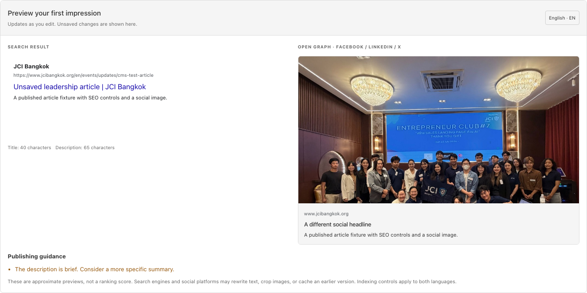

# CMS SEO editor upgrade

7 October 2026 · JCI Bangkok

The previous CMS had basic page/article title and description fields. This upgrade adds a shared SEO editor for every standalone public content type: Pages, Articles, Events and Projects. It also creates seven built-in page records so editors can control SEO for the homepage, About, Events, Members, Membership, Contact and PhotoBomb.

## Editor features

- Content and SEO/social tabs, with live previews of unsaved search and Open Graph text.
- English and Thai search titles/descriptions, separate social titles/descriptions, social image selection and image descriptions.
- Automatic fallbacks to content text/images and the site-wide social image. The brand suffix is applied once.
- Character counts, image-width guidance, missing-content warnings and an optional editorial focus phrase. The focus phrase is not a meta keywords tag or ranking score.
- Advanced canonical override, noindex, nofollow and sitemap exclusion controls. Invalid URL schemes, embedded credentials and URL fragments are rejected.
- Twenty-five saved revisions per document, with Payload's version comparison and restore interface.
- Draft/published states for articles and projects. Articles also retain publish-date scheduling; drafts and future articles are hidden from public routes and anonymous content APIs.
- Viewer roles can inspect content but cannot modify it. User role changes and account creation/deletion require a super admin, preventing viewers from granting themselves editor privileges.
- Removed hardcoded storage/auth credential fallbacks. PAYLOAD_SECRET is now required; secrets are read only from the server environment. Existing configured credentials are not changed.
- Public author bylines for articles, plus optional postal address and numeric ticket-price fields for event structured data. Existing visitor-facing price text remains supported.
- New custom CMS pages render at their published paths. Built-in page records control SEO for the existing layouts; their visual content continues to use the site's existing settings and dictionaries.

## How editors use it

1. Open an article, event, project or page and select **SEO & social**.
2. Select English or Thai using Payload's locale selector.
3. Leave fields blank to use the shown defaults, or enter search/social overrides. Set the image in **Open Graph & social cards**.
4. Review the previews and publishing guidance. Save changes; drafts must be marked Published before they appear publicly.
5. Use **Versions** to compare or restore saved revisions.

For a built-in page, open its record in **Pages**. For board-year SEO, create a Page record with the existing board path, such as `members/board/2026`. Custom page paths must avoid reserved site routes.

The previews are approximate. Search engines may rewrite snippets, and social platforms may crop images or cache old metadata. Published-page content remains the source of truth for structured data. Saved revision history is available; unsaved previews are not an autosave or a full draft-page preview.

## Metadata and indexing behavior

| Setting | Public behavior |
| --- | --- |
| Search title/description | HTML title and description; fallback to content or built-in page defaults |
| Social title/description/image | Open Graph and Twitter metadata; fallback to search text and content/site images |
| Noindex | Emits noindex and omits the page from the sitemap, in both languages |
| Nofollow | Emits nofollow for the page |
| Exclude from sitemap | Omits the page without blocking public access or guaranteeing removal from search |
| Canonical override | Changes the canonical/social URL, omits that language URL from the sitemap, and suppresses automatic language alternates for that page |
| Draft or scheduled article | Hidden from public content queries and anonymous APIs |

Canonical defaults, Open Graph values and live previews use the same metadata rules. Do not use indexing controls as access control for private information.

## Database migration and deployment

**The live database has not been migrated, and this upgrade has not been deployed.** It was built and tested with isolated PostgreSQL databases on localhost.

The repository includes a legacy baseline and an additive upgrade migration. The baseline adopts existing complete core tables instead of recreating them; a fresh installation receives the original schema first. The upgrade adds SEO columns, revision tables, article/project publication states, public-author/event fields and the default social image relation. It preserves existing article SEO values by reusing their original PostgreSQL columns and marks pre-existing articles/projects Published. Built-in Page records are inserted only when their slug does not already exist.

Automatic schema push is disabled. Apply migrations explicitly through the normal deployment process, using a verified backup and a staging database before production. Baseline rollback is intentionally disabled; the upgrade's generated rollback removes its added data and revision tables and should not be used casually.

Before deploying:

1. Verify the hosting environment supplies PAYLOAD_SECRET and the required S3 credentials. The old configuration contained embedded credential fallbacks; review their exposure and rotate previously committed credentials through the normal operations process. This change removes the fallbacks but does not rotate credentials or alter Git history.
2. Confirm the target database schema matches the legacy baseline. Older unmanaged schema changes must be reconciled on staging first.
3. Check `npm run cms:migrate:status` and run `npm run cms:migrate` against staging. If Payload reports a previous development schema push (`batch = -1`), stop and reconcile that history; do not force-accept its data-loss warning.
4. Verify existing content, saved SEO values and editor accounts on staging.
5. Apply the same reviewed migration to production, then build and deploy the matching code with production environment variables. The local build used for verification contains isolated test fixtures and must not be published as a deployment artifact. Use a controlled release window: the previous code does not understand the new article SEO object/API shape.
6. Set `NEXT_PUBLIC_SERVER_URL=https://www.jcibangkok.org`. Keep S3 enabled on production; `S3_ENABLED=false` is for isolated tests or intentionally configured local storage.
7. Check production SEO output, sitemap and editor behavior after release.

No test fixture setup command should be run against production. It requires a localhost database whose name ends in `_test` and disabled S3 storage.

## Developer commands

```sh
npm run cms:migrate:status
npm run cms:migrate
npm run cms:migrate:create -- descriptive_name
npm run cms:generate:importmap
npm run cms:generate:types
npm run lint
npm run build
```

The Payload commands explicitly load the TypeScript runner to avoid the CLI's namespace-loader failure on this environment's Node version.

To repeat isolated testing, create an empty localhost test database, set `DATABASE_URI`, a local `PAYLOAD_SECRET` and `S3_ENABLED=false`, then run migrations and `npm run check:cms:fixtures`. The fixture command also creates/recreates a dedicated `jci_cms_legacy_test` database to test legacy-schema adoption; it must remain restricted to a disposable local PostgreSQL cluster. Start the built site on port 3100 and run `npm run check:cms:ui`, followed by `npm run check:seo`.

## Verification results

- TypeScript, lint, SEO unit checks and the production build passed against an isolated migrated database.
- A separate legacy-schema test verified that existing rows and article SEO values survive migration and that existing articles/projects remain Published.
- Revision restoration, anonymous draft filtering and viewer write restrictions passed.
- Browser tests covered all four content editors, unsaved search/social preview updates, image loading, Thai locale switching, mobile fit, canonical validation and a saved SEO round trip to public HTML.
- Noindex, canonical overrides and sitemap exclusions were checked against real rendered pages and XML output.
- The public SEO suite verified 17 pages and 22 canonical sitemap URLs in the test fixture dataset. The previous production dataset had 36 URLs; test fixture counts are not production inventory counts.



## Scope

Embedded member stories, partner records and individual board members have no standalone URLs, so they do not receive misleading per-record Open Graph controls. Their parent pages' SEO is edited in Pages. This upgrade does not add analytics, keyword-volume data, automatic redirects for renamed slugs, autosave, authenticated full-page draft previews or custom raw JSON-LD editing. Keep published slugs stable and arrange a reviewed redirect if a URL must change.

Payload references: [custom components](https://payloadcms.com/docs/custom-components/overview), [React hooks](https://payloadcms.com/docs/admin/react-hooks), [database migrations](https://payloadcms.com/docs/database/migrations).
